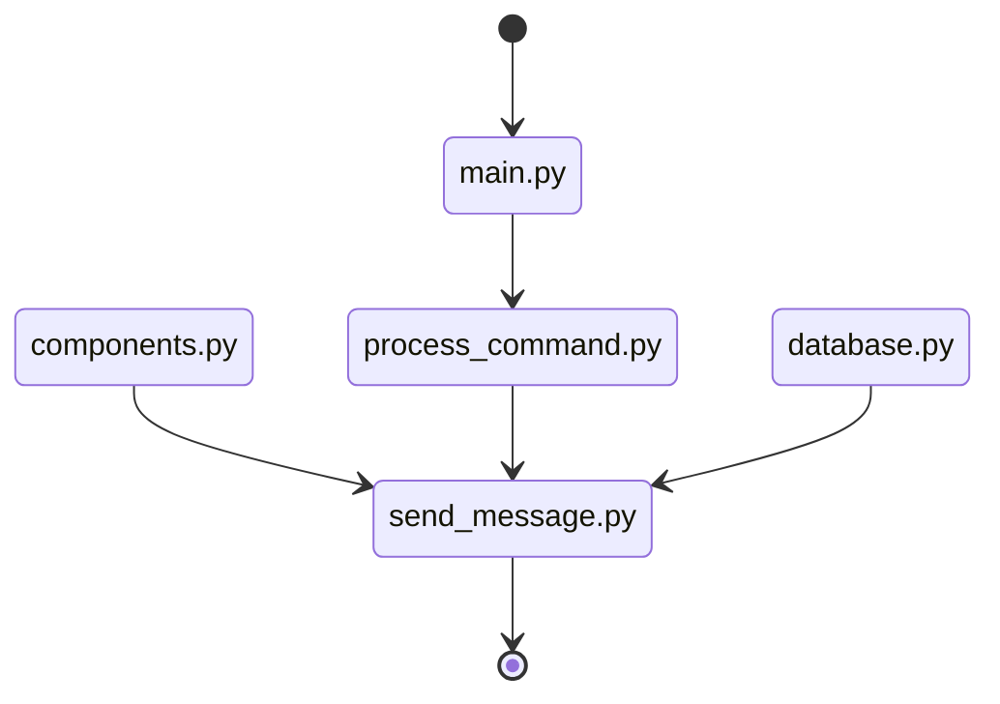

# Lista de chamada 
Bot para discord feito utilizando Python e Heroku PostgreSQL como base de dados. A aplicação está hospedada na plataforma Heroku.

## Instalar dependências
  - pip install -r requirements.txt
  
## Rotina de testes
  - pytest

## Inicializar bot
  - python main.py

# Fluxograma de operação

